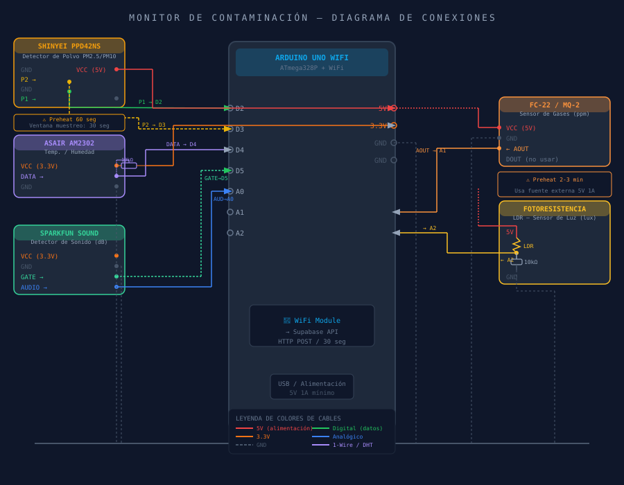
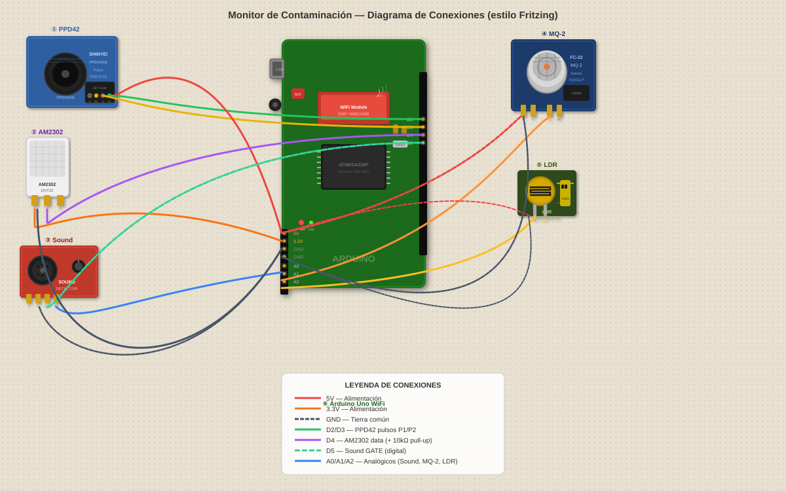

# Esquema de Conexiones

## Mapa de Pines — Arduino Uno WiFi Rev2

| Pin Arduino | Sensor | Señal |
|---|---|---|
| D2 | PPD42 | P1 (salida digital) |
| D4 | DHT22 / AM2302 | Data |
| D5 | Micrófono | Gate (digital) |
| A0 | Micrófono | Analógico (nivel sonoro) |
| A1 | MQ-2 | Analógico (gas ppm) |
| A2 | LDR | Analógico (luminosidad) |

## Diagramas de conexiones

### Diagrama esquemático

### Diagrama Fritzing

